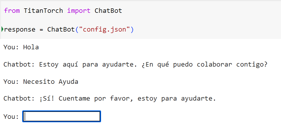

# Titan Network Torch (TNT)
Es una poderosa Herramienta de Procesamiento del lenguaje natural, aprendizaje por refuerzo, análisis de series temporales, detección de anomalías

## Versión 1.0

## Crear un entorno virtual (Opcional)

```bash
python3 -m venv env
source env/bin/active
```


## Instalar dependencias necesarias

```bash
pip install TitanTorch
```


## Archivo config.json

Debe crear un archivo config.json con las preguntas y respuestas previamente formuladas para el aprendizaje del modelo
La estructura de este JSON debe seguir estas pautas

```json
[
    {
      "tag": "saludo",
      "patterns": [
        "Hola",
        "Buenos días",
        "¿Cómo estás?"
      ],
      "responses": [
        "¡Hola! ¿En qué puedo ayudarte hoy?",
        "¡Buenos días! ¿Cómo puedo asistirte?",
        "Estoy aquí para ayudarte. ¿En qué puedo colaborar contigo?"
      ]
    }
]
```

Los tag son el ID del tipo de interacción que se esta realizando.
Los patterns son los patrones de entra del input dele usuario.
Los responses son un conjunto de respuestas que el modelo puede usar para retonar

## Ejemplo de config.json

```json
[
    {
      "tag": "saludo",
      "patterns": [
        "Hola",
        "Buenos días",
        "¿Cómo estás?"
      ],
      "responses": [
        "¡Hola! ¿En qué puedo ayudarte hoy?",
        "¡Buenos días! ¿Cómo puedo asistirte?",
        "Estoy aquí para ayudarte. ¿En qué puedo colaborar contigo?"
      ]
    },
    {
      "tag": "despedida",
      "patterns": [
        "Adiós",
        "Hasta luego",
        "Nos vemos luego"
      ],
      "responses": [
        "¡Adiós! Que tengas un buen día.",
        "¡Hasta luego! No dudes en volver si necesitas ayuda.",
        "Nos vemos pronto. ¡Cuídate!"
      ]
    },
    {
      "tag": "ayuda",
      "patterns": [
        "Necesito ayuda",
        "Puedes ayudarme",
        "Quiero que me ayudes",
        "¿Podrías ayudarme?",
        "¿Podrías aconsejarme?",
        "¿Podrías darme un aconsejo?",
        "Dame un consejo"
      ],
      "responses": [
        "¡Claro! ¿Qué ocurre?",
        "¡Sí, por supuesto! ¿Pasa algo?",
        "¡Sí! ¿Te sientes mal?",
        "¡Sí! Cuentame por favor, estoy para ayudarte.",
        "¡Por supuesto! ¿En qué puedo ayudarte?",
        "¡Por supuesto! Cuentame tu situación, por favor.",
        "¡Por supuesto! Estoy para ayudarte, cuéntame sobre tu situación.",
        "¡Por supuesto! Dime como te sientes y qué podría ayudarte."
      ]
    },  
    {
      "tag": "definicion_burnout",
      "patterns": [
          "¿Qué es el burnout?",
          "¿Cómo puedo reconocer si estoy experimentando burnout?",
          "Señales de burnout"
      ],
      "responses": [
          "El burnout es un estado de agotamiento físico, emocional y mental causado por el estrés crónico en el trabajo.",
          "Algunas señales de burnout incluyen el agotamiento constante, la falta de motivación, la irritabilidad, el aislamiento social y la disminución del rendimiento laboral.",
          "Si te sientes abrumado, desmotivado y agotado física y emocionalmente, es posible que estés experimentando burnout. Es importante buscar apoyo y tomar medidas para cuidar tu bienestar."
      ]
    },
    {
      "tag": "ansiedad",
      "patterns": [
        "Siento que no puedo concentrarme en el trabajo.",
        "Estoy constantemente preocupado por mi desempeño laboral.",
        "Me cuesta trabajo relajarme después de un día de trabajo intenso."
      ],
      "responses": [
        "Prueba técnicas de respiración profunda para reducir la ansiedad.",
        "Haz pausas cortas durante el día para desconectar y relajarte.",
        "Habla con tu supervisor sobre cómo te sientes, podría ofrecerte apoyo adicional."
      ]
    },
    {
      "tag": "depresion",
      "patterns": [
        "Me siento mal",
        "No me siento del todo bien",
        "Siento que mi trabajo no tiene sentido o propósito.",
        "No tengo energía para enfrentar mis responsabilidades laborales.",
        "Me siento abrumado y sin esperanza en mi trabajo."
      ],
      "responses": [
        "Considera hablar con un terapeuta o consejero para obtener apoyo emocional.",
        "Busca actividades que disfrutes fuera del trabajo para mejorar tu estado de ánimo.",
        "Habla con recursos humanos sobre la posibilidad de ajustar tu carga de trabajo si te sientes abrumado."
      ]
    },
    {
      "tag": "estres",
      "patterns": [
        "Me siento constantemente tenso y nervioso en el trabajo.",
        "Tengo dificultades para conciliar el sueño debido al estrés laboral.",
        "Siento que tengo demasiadas tareas y plazos para cumplir."
      ],
      "responses": [
        "Haz ejercicio regularmente para liberar tensiones y reducir el estrés.",
        "Practica técnicas de manejo del tiempo para priorizar tareas y evitar la sobrecarga.",
        "Considera hablar con tu supervisor sobre la redistribución de tareas si te sientes abrumado."
      ]
    }
]
```

## Ejecución

```python
from TitanTorch import ChatBot

response = ChatBot("config.json")
```

## Output




## ¿ Cuándo usar ChatBot como solución para proyectos ?

* **Servicio de atención al cliente 24/7:** Para responder preguntas frecuentes, resolver problemas básicos, guiar al usuario por el sitio web, recomendar productos, responder preguntas de envíos y devoluciones, etc.

* **Agendar Citas:** Puedes usarlo como alternativa para gestionar la agenda, programar citas y enviar recordatorios.

* **Captación de clientes potenciales:** Puede recopilar información y datos del usuario para clasificarlos.

* **Asistente virtual:** Para ayudar a los usuarios a crear listas de tareas, gestionar su tiempo, etc.

* **Educación y formación:** Para proporcionar respuestas rápidas a preguntas, explicación de conceptos y apoyo en el aprendizaje. Para enseñar a aprender idiomas, matemáticas, etc.

* **Juegos Interactivos:** Para crear o predecir experiencias de juego y usuario más inmersas y personalizadas.

* **Marketing y Publicidad:** Para segmentar la audiencia y ofrecer mensajes personalizados acordes a ella.

* **Investigación de mercado:** Para recopilar opiniones de los usuarios sobre productos o servicios. 

* **Reservas de viajes:** Para reservar vuelos, hoteles, coches y otros servicios turísticos. 

* **Asistencias de compras online:** Para encontrar productos, comparar precios y obtener recomendaciones personalizadas. 

* **Entretenimientos:** Para jugar juegos, contar historias, dar predicciones de gustos sobre las mejores o peores (mediante un filtro) películas y libros, etc.

* **Gestión de redes sociales:** Para responder a los mensajes, publicar contenido, analizar datos, etc.